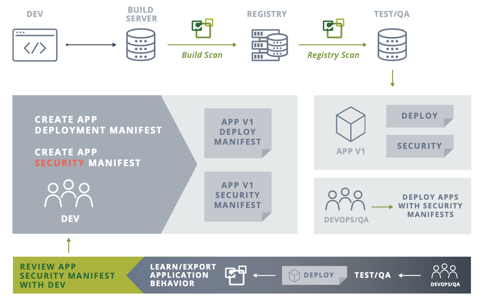

# TenStepstoAutomateContainerSecurity-Pt2
Automating Container Security Into the CI/CD Pipeline - Operations Point of View

## Introduction

Welcome to Part 2 of automating Container security into the CI/CD Pipline targeted at the Operations role. This is part of a 2 part series.  If you haven't read Part 1, please do so before reading this article.

## Security Policy as Code and Behavioral Learning

Automating vulnerability scanning is a great start for securing containers. What is even more challenging and important is automating the creation of security policies to protect application workloads in production. Run-time security policies, especially firewall rules, have up to now largely required manual configuration in legacy data center-based infrastructures.

However, in modern cloud deployments, the use of Kubernetes custom resources to declare an application security policy at any stage in the pipeline provides a solution to this problem.

Developers, DevOps, and Security teams can use custom resource definitions (CRDs) to automate and maintain run-time security policies. CRDs can also be used to enforce global security policies across multiple Kubernetes clusters.

Behavioral Learning is a useful technique to learn and characterize an application’s behavior to automatically draft the security policy CRD. This CRD can then be reviewed by Dev, DevOps and Security teams and edited as needed, then signed off as the security policy for the application. This CRD ‘code’ can then be checked into the change management system before it is deployed into production.

### Key Automation Steps in Bridging the CI/CD pipeline include: 

5. Security Policy as Code and Behavioral Learning

A. Capture the ‘allowed’ application behavior in standard CRD yaml files. Behavior should include allowed network connections and protocols including ingress/egress, processes, and file access activity. Security policies that are not tied to specific applications such as global security rules can also be expressed in separate CRDs.

B. Build review, approval, and check-in steps into the pipeline so the security policy as code represents the ultimate authority for production security rules.

C. Deploy the security policy CRDs into the production environment before the new or updated applications are deployed, thereby ensuring the new workloads are secured from the moment they start running.

6. Use Behavioral Learning to Automate Security Policy

A. In the test, QA, and/or staging environments, run the applications and their associated test suites and use behavioral learning to capture allowed application behavior in the form of network, process, file and other security rules.

B. Export the rules as a CRD for review and use in Step 5 above.

The diagram below shows the workflow using behavioral learning to help generate the security policy CRD for a new application.

The top of the diagram shows the workflow where developers create the app, app deployment manifest, and build the image, which goes through automated scanning process in Steps 1 and 2. At the same time, the DevOps/QA team runs the app (bottom of the diagram, going right to left), and uses NeuVector behavioral learning to create the security manifest (CRD) for review with the Dev team. After being approved and tested, the CRD is checked-in to the change management system and deployed into the production environment to protect the new application from run-time attacks.

## What is a NeuVector Custom Resource Definition (CRD)? 

The NeuVector CRD enables creation of security policy as code with Kubernetes-native yaml files. The CRD defines allowed application behavior, such as:

** ADD BOXES for Network Connection, Container Process, Container File Activity **

In addition, other NeuVector security related configurations can be declared:

** ADD BOXES for GROUPS, APP Protection State & Other CONFIGS **

CRDs are RBAC controlled by Kubernetes automatically, so only users with appropriate access (namespaced or cluster admin) will be allowed to create or modify the security policy as code resources.

## Integration Points that Operations & Security roles should consider as a guide to automating container security

### Complete Run-Time Protection

#### Key Automation Steps in the CI/CD pipeline include: 

Once they are running in production, containers, their hosts, and the orchestrator need to be protected against attacks. Complete run-time protection should include container process and file access controls, host monitoring, and most critically, network security with deep packet inspection. In the past, network firewall rules and endpoint security policies required heavy manual customization, but this can’t be required for modern automated pipelines.

Run-time security starts with admission controls as a gatekeeper for the production environment, and progress through run-time scanning and compliance checks to real-time attack prevention.

7. Use Admission Controls to Prevent Vulnerable or Unauthorized Deployments

A. Use criteria such as vulnerability scan results, namespaces, registries, and container properties (e.g. running as root) to control deployments.

B. While creation of these rules can be automated or manual, enforcement and alerting should be automated.

8. Deploy a Layer7 Container Firewall for Automated Segmentation and Threat Detection

A. Automate blocking, quarantine, packet capture, and alerting for network attacks and segmentation violations.

B. Use Security Policy as Code to automate rule creation and updates.

9. Use Endpoint Security Controls FOR Containers And Hosts.

A. Automate blocking and alerting for suspicious process and file activity in containers and hosts.

B. Use Security Policy as Code to automate rule creation and updates.

### What is Container Network Segmentation

NeuVector provides a true cloud-native Layer 7 [container firewall](https://neuvector.com/solutions/run-time-container-security/) which does network segmentation automatically. By using behavioral learning, connections and the application protocols used between services are discovered and whitelist rules to isolate them are automatically created. This means that container segmentation is easy and automated, without requiring knowledge of connections beforehand or the manual creation and maintenance of segmentation rules.
With a cloud-native, Layer 7 container segmentation solution, workloads can be segmented even if they are running on the same host or in the same cluster. This is especially valuable to fulfill industry standard compliance requirements such as PCI DSS.

### The Ultimate Cloud Security Pattern - Container Segmentation

Ultimately, to give the business the most flexibility for rapid release and optimal resource utilization, container segmentation must be enforced on each pod and follow application workloads as they scale and move dynamically. In this micro-perimeter vision article, NeuVector CTO Gary Duan outlines a vision for cloud security where the protection perimeter surrounds the workload even as it moves across hybrid clouds.

10. Automating Alerting and Realtime Responses

A. Generate special alerts for critical security events.

B. Quarantine suspicious containers.

C. Initiate packet captures for investigation and forensics.

D. Integrate with case management tools to address security and compliance violations.

NeuVector provides several mechanisms for automation and integration in Step 10. These include SYSLOG event output, customized webhook alerts, automated packet capture & quarantine, and a REST API for customized, scripted automations. A Prometheus exporter and Grafana dashboard is
also supported.

## Summary

Ultimately, to give the business the most flexibility for rapid release and optimal resource utilization, container segmentation must be enforced on each pod and follow application workloads as they scale and move dynamically. In this [micro-perimeter vision article](https://neuvector.com/cloud-security/container-security-micro-perimeters/), NeuVector CTO Gary Duan outlines a vision for cloud security where the protection perimeter surrounds the workload even as it moves across hybrid clouds.

